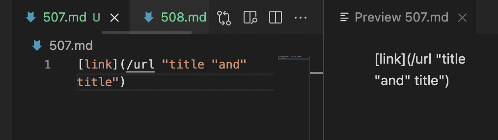
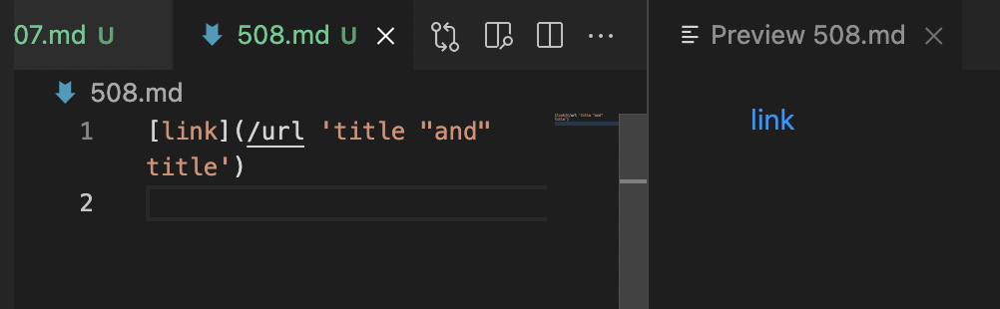
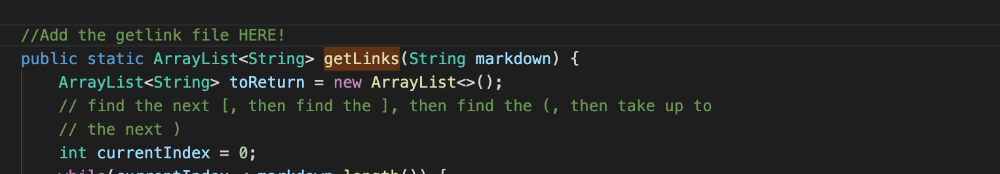

# Week 10 Lab Report 5 
Two test I choose are test file 507 and 508:
1. 507.md 
    Expected output: []
2. 508.md 
    Expected output: []

My own implementation with output:
```
public static ArrayList<String> getLinks(String markdown) {
        ArrayList<String> toReturn = new ArrayList<>();
        // find the next [, then find the ], then find the (, then take up to
        // the next )
        int currentIndex = 0;
        while(currentIndex < markdown.length()) {
            if (markdown.indexOf(")", currentIndex) == -1) {
                break;
            }
            int nextOpenBracket = markdown.indexOf("[", currentIndex);
            System.out.println(nextOpenBracket);
            int nextCloseBracket = markdown.indexOf("]", nextOpenBracket);
            int openParen = nextCloseBracket + 1; //markdown.indexOf("(", nextCloseBracket);
            char possibleOpenParam = markdown.charAt(openParen);
            if (nextOpenBracket == -1 || nextCloseBracket == -1) break;
            if (possibleOpenParam != '(') break;
            if (markdown.charAt(nextCloseBracket + 1) == '(' && (markdown.indexOf(")", currentIndex) < markdown.indexOf("[", nextCloseBracket) ||
             markdown.indexOf("[", nextCloseBracket) == -1 && markdown.indexOf(")", currentIndex) != -1)) {
                int closeParen = markdown.indexOf(")", openParen);
                toReturn.add(markdown.substring(openParen + 1, closeParen));
                currentIndex = closeParen + 1;
            } else {
                currentIndex++;
            }
        }
        return toReturn;
    }
    public static void main(String[] args) throws IOException {
		Path fileName = Path.of(args[0]);
	    String contents = Files.readString(fileName);
        ArrayList<String> links = getLinks(contents);
        System.out.println(links);
    }
```
**Output:**
```
(base) jz@Js-MacBook-Air markdown-parse % java  MarkdownParse 507.md
0
[/url "title "and" title"]
(base) jz@Js-MacBook-Air markdown-parse % java  MarkdownParse 508.md 
0
[/url 'title "and" title']
```
**Professor implementation output:** (I will not Prof's code here so I can shorten the length of the report)
```
(base) jz@Js-MacBook-Air markdown-parse % java  MarkdownParse 507.md
[]
(base) jz@Js-MacBook-Air markdown-parse % java  MarkdownParse 508.md
[]
```
I searched through the codes manually to run the files in order and compare the difference between outputs. 
For both implementations, I believe my own impletement outputs are incorrect; From the preview of 507.md, we can conclude there is no valid link in this file. However, mine outputs whatever in the () if the format is correct not suspecting the URL behind the input link. For 508, although the preview shows we do have a valid link. Since we didn't exam the URL, we could not tell the link is valid or nor.
Thinking about how to fix my code, I should implement the section after examing the format of link markdown. Such as writing a function that will read the file behind the provide URL links and see if the link is vaild. 


- I should try to overload getlink method like what professor had done to his code. 
```
public static Map<String, List<String>> getLinks(File dirOrFile) throws IOException {
        Map<String, List<String>> result = new HashMap<>();
        if(dirOrFile.isDirectory()) {
            for(File f: dirOrFile.listFiles()) {
                result.putAll **(getLinks(f));**
            }
            return result;
        }
        else {
            Path p = dirOrFile.toPath();
            int lastDot = p.toString().lastIndexOf(".");
            if(lastDot == -1 || !p.toString().substring(lastDot).equals(".md")) {
                return result;
            }
            ArrayList<String> links = getLinks(Files.readString(p));
            result.put(dirOrFile.getPath(), links);
            return result;
        }
    }
``` 
- This section is the part that will take in the file and check if there is a valid URL link by reading the file behind the provided link. Below is where I should add this section:

This changes should fix for both test case for my own implementation. 


