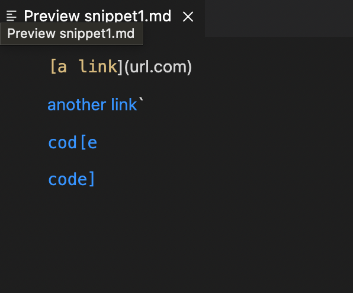
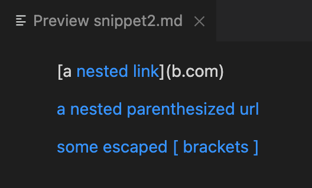
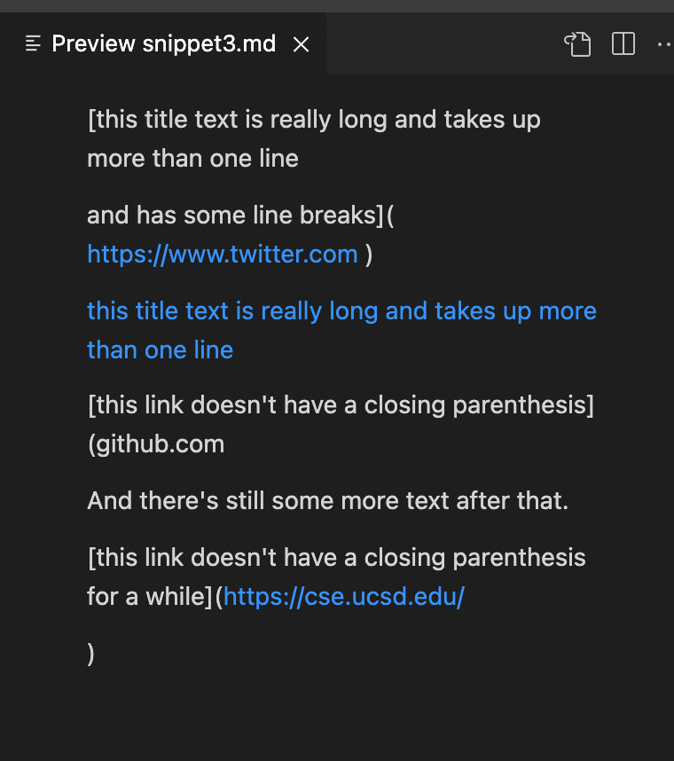
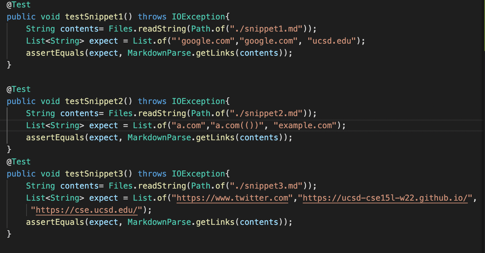
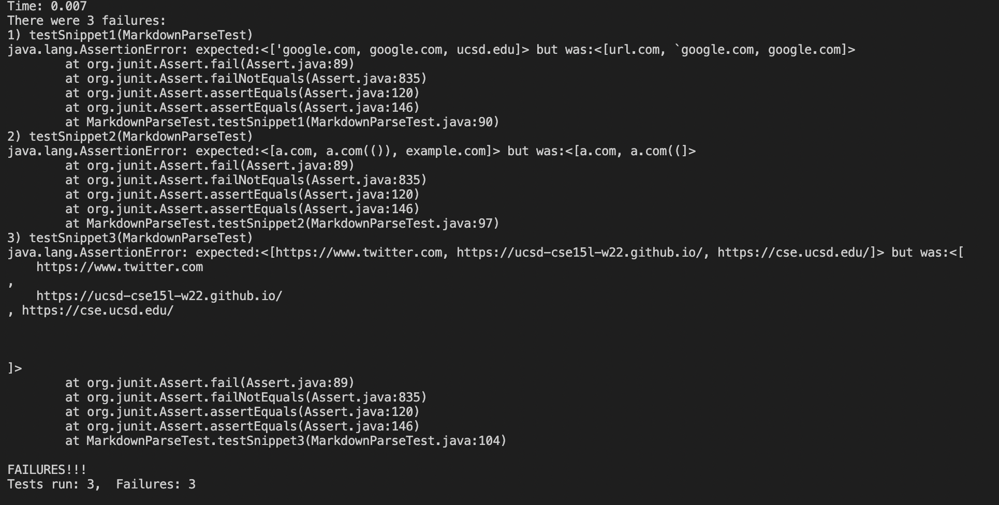
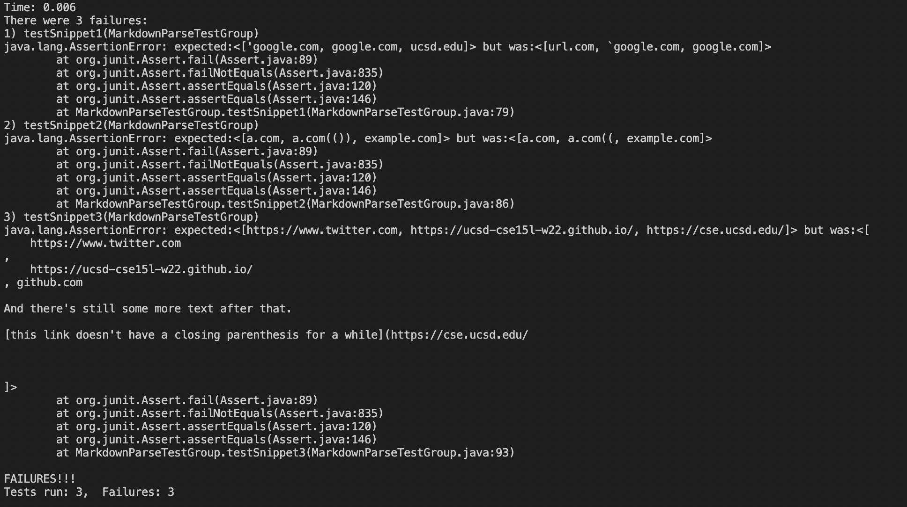

# Week 8 Lab 4
**Expectation for each snippets**

1. 
2. 
3. 

**How the Junit test will be** 

**Test result from my own implementation** 

**Test result from my reviewed implementation**

Questions Response: 
1. Yes, there can be a small change of code to solve this problem from Snippet 1. We have to define the position of the first bracket to the starter points and excluding any symbol before that. Then we can continue to find the rest of information by using the old code. We also check the position of closing ] and next openning ( to make sure we are looking at the last matched ] with the [. 
2. No. there might be a larger change for the code to deal with the nest link and next [] or (). We may use the nest for loop to check the nested information and comparing the distance between [] and () to verify the information we obtain is valid. 
3. Yes, the main issue is that we do not take care of the extra space in the (). What we can do is to find where the actual link text starts and the link stops and ignore all the reading info that is outside of this range. 