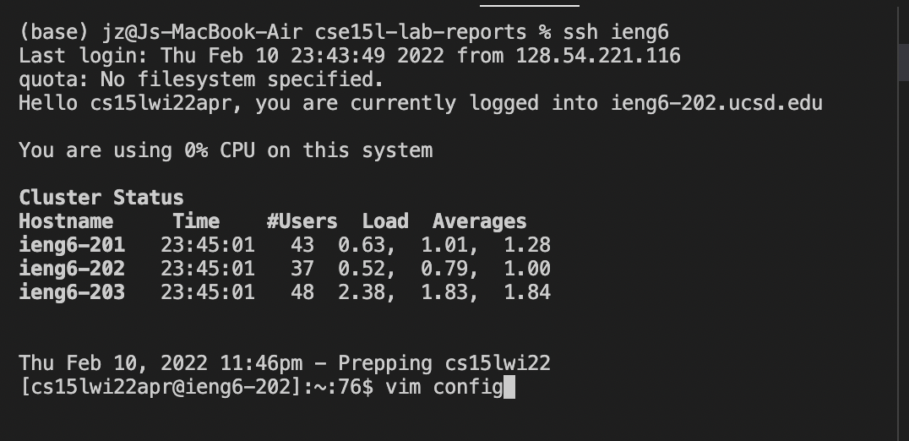
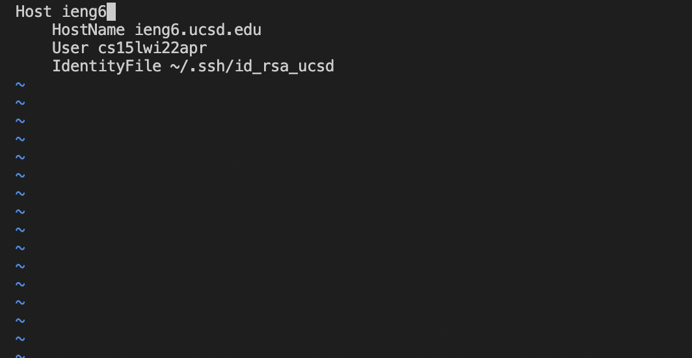
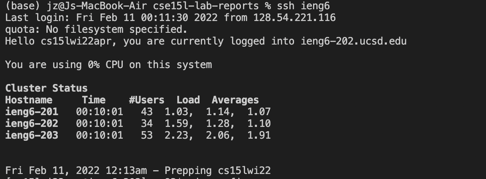

# Streamline ssh Configuration

The Goal for this task is to shorten the time to login our ssh account. 
1. 
    The first step is to log into your ssh account to esatblish the config file to tell what username is to be used and what server will be login.
    Note: I already set the key code in; therefore, when I login, I used the code already that is already set. 

2. 
    Then we create the config file with vim. 

3. 
    We established what username and sever the ieng 6 is corresponding to in the configfile. After we are done with that, we will exit the file by using :wq. 

4. 
    Then we can login the ssh by just using command `shh ieng6` without all extra work!

