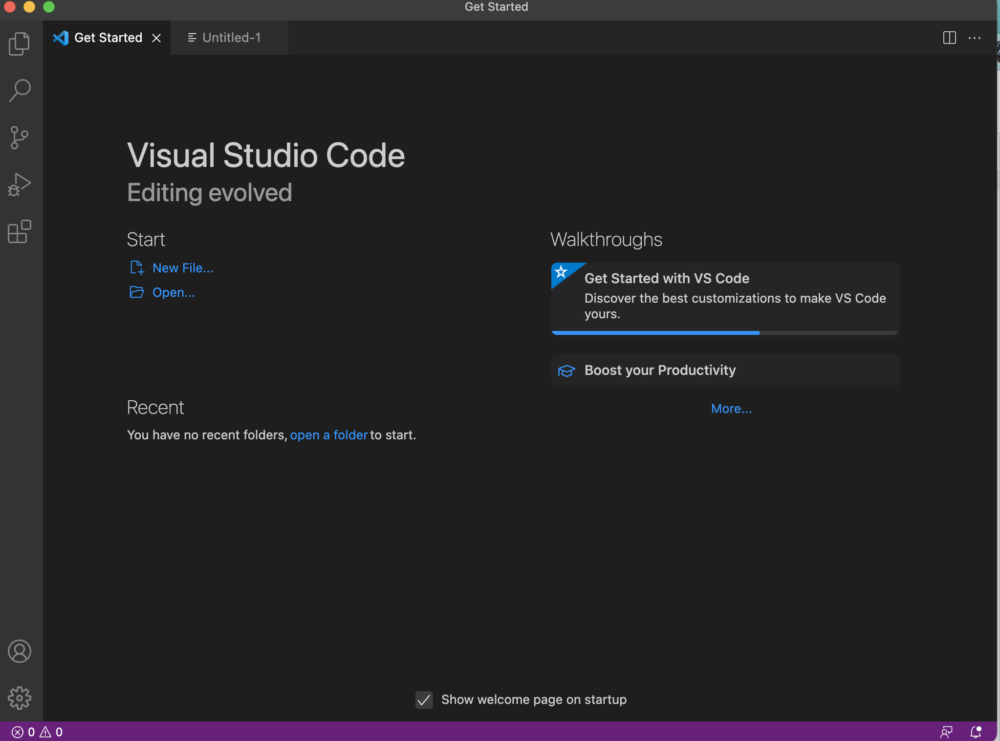
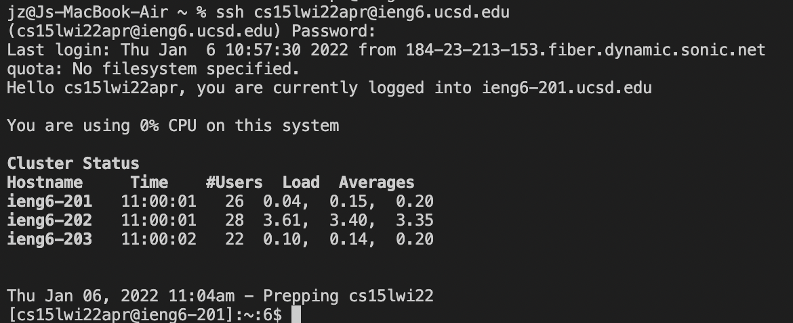
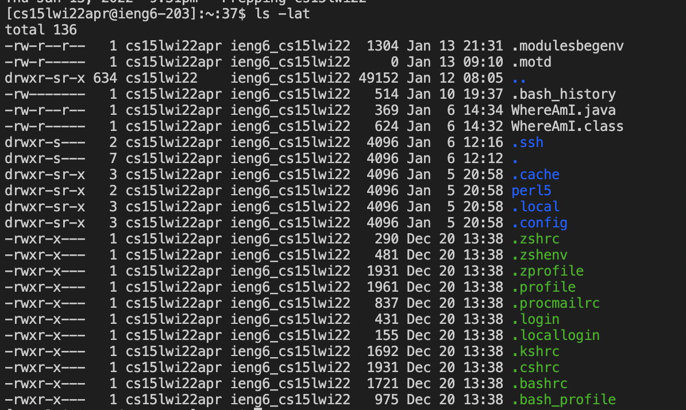
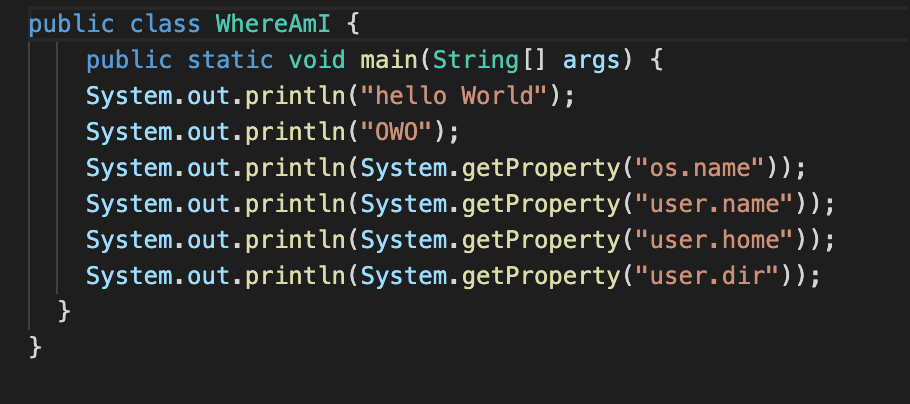
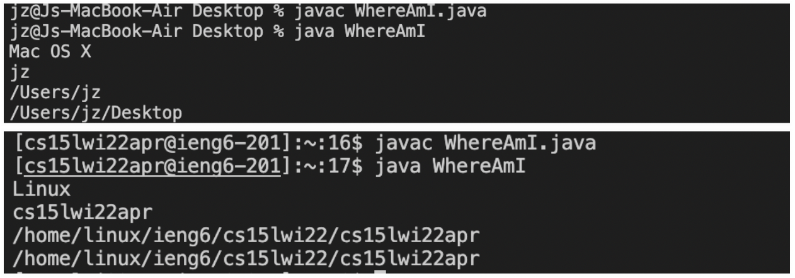
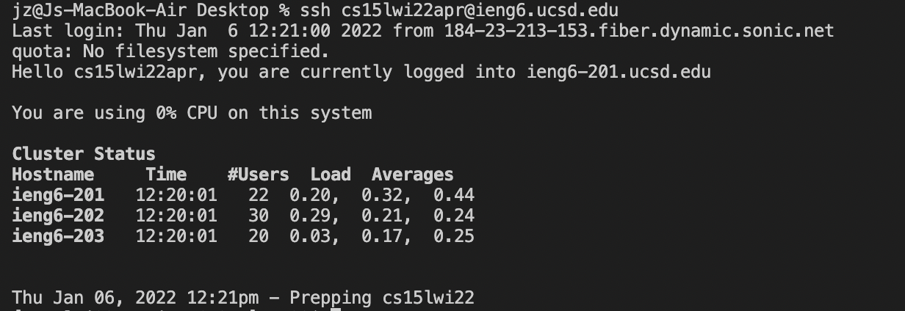
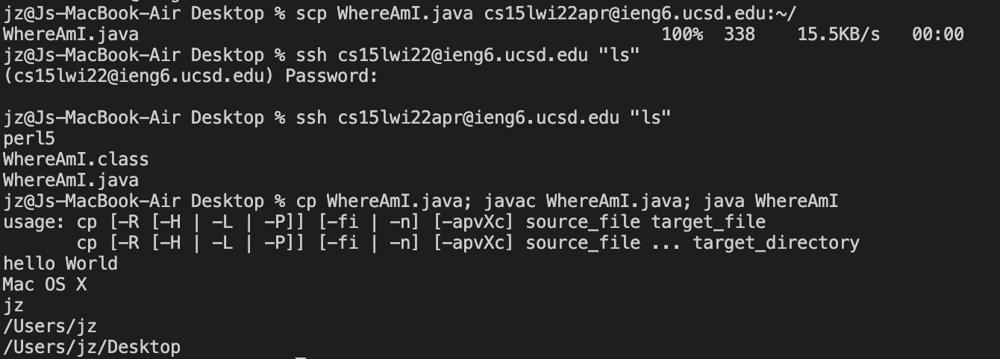

# 1.Installing VScode

Go to the VS code [website]( https://code.visualstudio.com/) and follow the instruction to download the VScode on your desktop. When you finish installing, the window of VScode should look like below: 


# 2.Remotely Connecting 
If you are a window user, please download [OpenSSH](https://docs.microsoft.com/en-us/windows-server/administration/openssh/openssh_install_firstuse)
Then, look up your personal course account for CSE15L on this [link](https://sdacs.ucsd.edu/~icc/index.php)

Once you find your account, open the terminal in VSCode and type $ssh cs15lwi22(your_special_pin)@ieng6.ucsd.edu. 
Type yes when you see the message that says the account can't be established, then give your password. You will see this message after login. 



# 3.Trying Some Commands
Try to type some command such as 
* `cd ~`
* `cd`
* `ls -lat`
* `ls -a`
* `ls <directory> where <directory> is /home linux/ieng6/cs15lwi22/cs15lwi22abc, where the abc is one of the other group members’ username`
* `cp /home/linux/ieng6/cs15lwi22/public/hello.txt ~/`
* `cat /home/linux/ieng6/cs15lwi22/public/hello.txt`

For example you will see something like this: 


# 4.Moving Files with scp
Make a local java file with the following codes: 

Then run the code with `java` and `javac`. 
To move your local file to SSH, run the command `scp WhereAmI.java cs15lwi22zz@ieng6.ucsd.edu:~/`

When you run the file again at your ssh account, you will see the difference in the path of the file. 

# 5.Setting an SSH Key
In order to login your ssh account locally with no password, run `ssh-keygen` at your terminal and follow the step like this: 
```
# on client (your computer)
$ ssh-keygen
Generating public/private rsa key pair.
Enter file in which to save the key (/Users/joe/.ssh/id_rsa): /Users/joe/.ssh/id_rsa
Enter passphrase (empty for no passphrase): 
Enter same passphrase again: 
Your identification has been saved in /Users/joe/.ssh/id_rsa.
Your public key has been saved in /Users/joe/.ssh/id_rsa.pub.
The key fingerprint is:
SHA256:jZaZH6fI8E2I1D35hnvGeBePQ4ELOf2Ge+G0XknoXp0 joe@Joes-Mac-mini.local
The key's randomart image is:
+---[RSA 3072]----+
|                 |
|       . . + .   |
|      . . B o .  |
|     . . B * +.. |
|      o S = *.B. |
|       = = O.*.*+|
|        + * *.BE+|
|           +.+.o |
|             ..  |
+----[SHA256]-----+
```
Then copy the public key to `.ssh` directory to your user account: 
```
$ ssh cs15lwi22zz@ieng6.ucsd.edu
<Enter Password>
# now on server
$ mkdir .ssh
$ <logout>
# back on client
$ scp /Users/joe/.ssh/id_rsa.pub cs15lwi22@ieng6.ucsd.edu:~/.ssh/authorized_keys
# You use your username and the path you saw in the command above
```

After that, when you log in, your login page should look like this: 

# 6.Optimizing Remote Running
There are some short-cut way to write the command 
1. add command after your login command 
    `ssh cs15lwi22@ieng6.ucsd.edu "ls"`
2. also write multiple command in one line and seperated by semicolon 
    `cp WhereAmI.java OtherMain.java; javac OtherMain.java; java WhereAmI`
    

